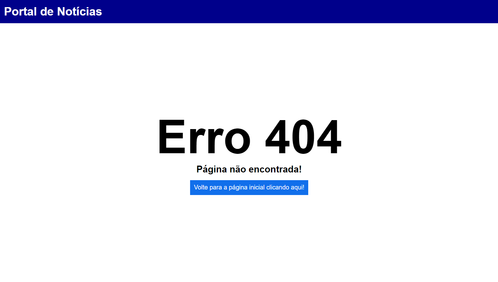

# Portal de Notícias

Esse projeto foi criado com [Create React App](https://github.com/facebook/create-react-app) e utiliza a versão 18.2.0 do React.

## API de Notícias

Esse projeto utiliza o [GNews](https://gnews.io/) para adquirir os dados das notícias  

## Link para acesso acessar a aplicação online

https://s-portal-noticias.netlify.app/

## Prints Portal

### Página Inicial

### Notícia

### Página não Encontrada

## Scripts Disponíveis

Execute `npm i` para instalar as dependências do projeto

No diretório do projeto, você pode executar `npm start` para executar o  app o aplicativo no modo de desenvolvimento.\
Abra [http://localhost:3000](http://localhost:3000) para visualizá-lo em seu navegador.

A página será recarregada quando você fizer alterações.\
Você também poderá ver erros de "lint" no console.

Execute `npm test` para testes no modo de observação interativo.\
Consulte a seção sobre [execução de testes](https://facebook.github.io/create-react-app/docs/running-tests) para obter mais informações.

O comando `npm run build` cria o aplicativo para produção na pasta `build`.\
Ele agrupa corretamente o React no modo de produção e otimiza o _build_ para obter o melhor desempenho.

A compilação é reduzida e os nomes dos arquivos incluem os hashes.\
Seu aplicativo está pronto para ser implantado!

Consulte a seção sobre [implantação](https://facebook.github.io/create-react-app/docs/deployment) para obter mais informações.

-------------------------------------------

### `npm run eject`

**Nota: esta é uma operação unidirecional. Depois de `ejetar`, você não pode voltar atrás!**

Se você não estiver satisfeito com a ferramenta de construção e as opções de configuração, você pode `ejetar` a qualquer momento. Este comando removerá a dependência de construção única do seu projeto.

Em vez disso, ele copiará todos os arquivos de configuração e as dependências transitivas (webpack, Babel, ESLint, etc) diretamente no seu projeto para que você tenha controle total sobre eles. Todos os comandos, exceto `eject`, ainda funcionarão, mas apontarão aos scripts copiados para que você possa ajustá-los. Neste ponto, você está por conta própria.

Você nunca precisa usar `eject`. O conjunto de recursos selecionados é adequado para implantações pequenas e médias e você não deve se sentir obrigado a usar esse recurso. No entanto, entendemos que esta ferramenta não seria útil se você não pudesse personalizá-la quando estiver pronto para isso.

## Saber mais

Você pode saber mais na [documentação sobre criação do aplicativo React](https://facebook.github.io/create-react-app/docs/getting-started).

Para aprender o React, confira a [documentação do React](https://reactjs.org/).

### Divisão de código

Esta seção foi movida para aqui: [https://facebook.github.io/create-react-app/docs/code-splitting](https://facebook.github.io/create-react-app/docs/code-splitting)

### Analisando o tamanho do pacote

Esta seção foi movida para aqui: [https://facebook.github.io/create-react-app/docs/analyzing-the-bundle-size](https://facebook.github.io/create-react-app/docs/analyzing-the-bundle-size)

### Criando um aplicativo da Web progressivo

Esta seção foi movida para aqui: [https://facebook.github.io/create-react-app/docs/making-a-progressive-web-app](https://facebook.github.io/create-react-app/docs/making-a-progressive-web-app)

### Configuração avançada

Esta seção foi movida para aqui: [https://facebook.github.io/create-react-app/docs/advanced-configuration](https://facebook.github.io/create-react-app/docs/advanced-configuration)

### Implantação

Esta seção foi movida para aqui: [https://facebook.github.io/create-react-app/docs/deployment](https://facebook.github.io/create-react-app/docs/deployment)

### `npm run build` falha ao minificar

Esta seção foi movida para aqui: [https://facebook.github.io/create-react-app/docs/troubleshooting#npm-run-build-fails-to-minify](https://facebook.github.io/create-react-app/docs/troubleshooting#npm-run-build-fails-to-minify)
